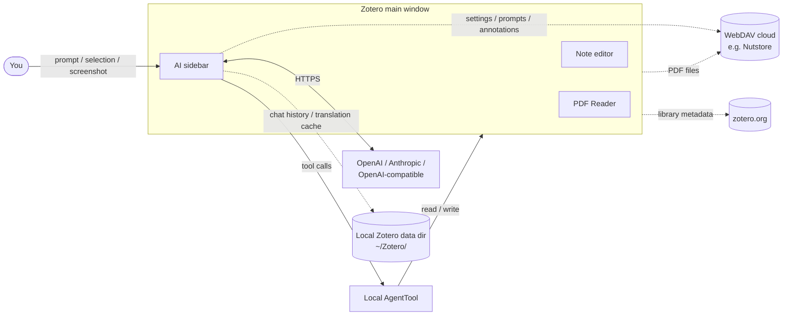
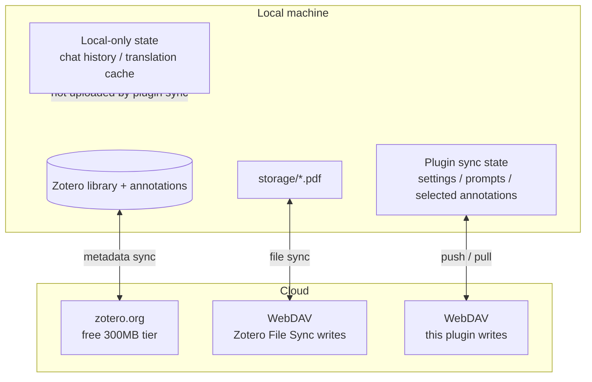

# Zotero AI Sidebar

[English](README.md) | [中文](README.zh-CN.md)

Zotero AI Sidebar is a Zotero 7/8/9 plugin that adds an AI chat panel to the Zotero item pane / PDF reading workflow. It is designed as a lightweight research agent: the model decides when to inspect the current Zotero item, annotations, PDF snippets, full PDF text, screenshots, or write annotations through exposed Zotero tools.

📖 **[Full usage guide](docs/USAGE.md)** ([中文](docs/USAGE.zh-CN.md)) — 5-minute quick start, common workflows, full feature reference, and troubleshooting.

🎨 **Rendered visual walkthroughs** — open these on GitHub Pages to see live mockups of the actual sidebar:
- [Quick Start (中/EN, 6 steps × 12 mockups, product-faithful)](https://xuhan-rgb.github.io/zotero-ai-sidebar/quick-start.html)
- [Task queue design prototype](https://xuhan-rgb.github.io/zotero-ai-sidebar/design_mockup.html)

## Highlights

- **AI chat inside Zotero** — a dedicated sidebar that always knows which paper you're reading.
- **PDF sentence translation mode** — click a sentence, translate it in-place, and walk through the paper with `Enter` / `Shift+Enter`.
- **PDF ↔ note reading workflow** — write answers into Zotero notes, jump back to the original PDF selection, and import selected chat text at the current note cursor.
- **Bring your own model** — Anthropic, OpenAI, or any OpenAI-compatible endpoint, all configured locally in Zotero preferences.
- **Read PDF, write notes & highlights** — model-driven tools cover full text, annotations, screenshots, and child notes.
- **Local-first history + WebDAV config sync** — keep chat history / translation cache local, while syncing presets, prompts, settings, and selected paper annotations through one `state.json` snapshot.

## What's New in v0.5.0-preview.1

- **arXiv LaTeX source as analysis context**: for arXiv papers, the plugin downloads the e-print, cleans the TeX, and feeds the model the source instead of the PDF text layer. Equation (1) reaches the model as exact `\mathbb{E}_{\mathcal{D},\tau,\omega}[\ldots]` instead of garbled `f l θ`. The sidebar header shows a `LaTeX 源` badge when the current item is running on the arXiv source.
- **Section-on-demand context budget**: the pinned front block is only the section index; the model fetches bodies as needed via new tools — `arxiv_get_section`, `arxiv_get_figure`, `arxiv_get_bibliography`. Non-arXiv items, and every failure path, fall back to the existing PDF full-text flow.
- **Per-paper repaired markdown cache** (non-arXiv fallback): vertically fragmented math runs in the PDF text cache are detected, the formula is rendered and cropped from the PDF, and a vision model transcribes it back to LaTeX. The result is persisted per paper, so first-run pays the transcription cost and later turns reuse the cache.
- **Front-block debug file**: when the sidebar `调试` toggle is on, the exact `[Paper full text]` block sent that turn is also saved to a file under Zotero's data dir, and the Markdown export footer points at it for cross-checking what the model actually saw.

## Install

1. Download the `zotero-ai-sidebar.xpi` you want from [GitHub Releases](https://github.com/xuhan-rgb/zotero-ai-sidebar/releases). Current stable: [`v0.4.2`](https://github.com/xuhan-rgb/zotero-ai-sidebar/releases/tag/v0.4.2). Current preview (arXiv LaTeX source + PDF formula repair): [`v0.5.0-preview.1`](https://github.com/xuhan-rgb/zotero-ai-sidebar/releases/tag/v0.5.0-preview.1) — `releases/latest` still points at the stable build.
2. Open Zotero 7, 8, or 9.
3. Go to `Tools` -> `Plugins`.
4. Click the gear icon and choose `Install Plugin From File...`.
5. Select the downloaded `.xpi` file and restart Zotero if prompted.

This repository currently publishes only the `.xpi` file. Zotero automatic update manifests (`update.json` / `update-beta.json`) are intentionally not published in the simplified release flow.

## Configuration

Open the AI Sidebar settings in Zotero and configure at least one model preset:

- Provider: `anthropic` or `openai`
- API key: stored locally in Zotero preferences
- Base URL: official endpoint or an OpenAI-compatible endpoint
- Model: any model ID supported by that endpoint
- Max tokens / tool iterations: local safety and output controls

For PDF sentence translation, configure the translation section in plugin settings:

- Trigger mode: single-click or double-click
- Overlay: compact or adaptive size, placed above or below the sentence
- Context: translate the sentence alone, or include paragraph/page context
- Shortcuts: `Enter` for the next sentence, `Shift+Enter` for the previous (default)

Do not hardcode personal API keys, base URLs, or private model IDs in this repository.

## Features

### Chat & UI

- **AI chat inside Zotero**: open a dedicated sidebar and discuss the current paper without leaving Zotero.
- **Configurable providers**: supports Anthropic, OpenAI, and OpenAI-compatible endpoints through local Zotero preferences. Model presets include connectivity tests and a per-preset model list with a footer switcher.
- **Quick prompts & slash commands**: customizable prompt buttons next to the composer plus built-in slash commands (`/arxiv-search`, `/web-search`) that expand into explicit instructions for the model.
- **Markdown output**: renders headings, lists, code blocks, quotes, links, thinking/context blocks, and tool-call traces.
- **Selection context bar**: when PDF text is selected, the composer shows whether the next turn is `只看选区` or `选区 + 全文`, with a one-turn full-text override and selection preview.
- **Customizable chat UI**: nickname and avatar (emoji or image URL) for both user and AI, plus configurable position and layout for the per-message action buttons.
- **Clean / debug copy modes**: copy the conversation as Markdown with the paper introduction, dialogue, and selected PDF text; debug mode also includes tool context, PDF snippets, model-input layout, and thinking summaries.

### PDF & research tools

- **Model-driven Zotero tools**: follows a Codex-style tool loop; no local keyword/regex intent planner decides what PDF content to send.
- **PDF context tools**: current item metadata, annotations, PDF search, PDF range reading, full PDF reading, and selected-text context.
- **Selected-text source tracing**: selected passages are preserved in chat bubbles and Markdown exports, with a jump control back to the original PDF selection when Zotero provides location data.
- **Image context**: attach screenshots/images so the model can analyze figures, UI states, or PDF screenshots.
- **Customizable annotation color guide**: edit the natural-language rubric the model uses when picking PDF highlight colors, with a default that maps Zotero's six preset hexes to common review categories (background, problem, method, dataset, results, etc.).
- **arXiv paper tools**: `paper_search_arxiv` and `paper_fetch_arxiv_fulltext` let the model search arXiv and fetch full text on demand.

### Notes

- **In-pane note editor**: open a note column alongside the chat to edit Zotero's rich note in place, with an assistant-to-note write tool.
- **Model-driven note writes**: the model can also call `zotero_append_to_note` on its own to append assistant output to the current item's child note, auto-creating one when none exists.
- **Cursor-aware note imports**: select part of an assistant response, right-click `Import to note`, and the snippet is inserted at the current Zotero note cursor instead of always appending.
- **Stable note position**: after writing to a note, the note pane restores the previous scroll / mouse anchor / caret position instead of jumping to the top.
- **Back to original PDF selection**: exported note blocks and assistant context chips include a `View original selection` jump so you can return from notes or chat to the PDF passage that produced the answer.

### Translation

- **PDF sentence translation mode**: turn on `译` mode in the PDF Reader, click a sentence to translate it in-place, and move between sentences with `Enter` / `Shift+Enter`.

### Sync & config

- **Config backup & restore**: export/import account presets, UI settings, quick prompts, and tool/MCP settings as a single JSON file.
- **WebDAV cloud sync**: push and pull settings, quick prompts, translation settings, and selected paper annotations to a WebDAV endpoint (e.g. Nutstore) via a single `state.json` snapshot.
- **Local chat and translation cache**: conversation history and sentence-translation cache are stored under Zotero's local data directory (usually `~/Zotero/`) and are not uploaded by the plugin's WebDAV sync.
- **Local-first config**: API keys, base URLs, model names, and private provider settings stay in Zotero prefs, not in source code.

## Architecture



### Three-layer cloud-sync split



## Development

Install dependencies:

```bash
npm install
```

Run tests:

```bash
npm test
```

Build a local XPI:

```bash
npm run build
```

The build output is written to `.scaffold/build/`. Local `.xpi` files are ignored by Git and should not be committed.

## Release

After `/auto-commit` updates the version, run `npm run release:xpi` — it tags, pushes, builds via GitHub Actions, and publishes the Release in one step. Flags (`--republish`, explicit tag) and verification details are in [`docs/RELEASE.md`](docs/RELEASE.md).

## Design notes

Project-specific modification guidance (Codex-style agent direction, Claudian-style chat UI, Better Notes-inspired note editing, non-negotiables) lives in [`CLAUDE.md`](CLAUDE.md). Tool / Web Search / MCP usage is in [`docs/TOOLS_AND_MCP.md`](docs/TOOLS_AND_MCP.md).

## License

AGPL-3.0-or-later.
