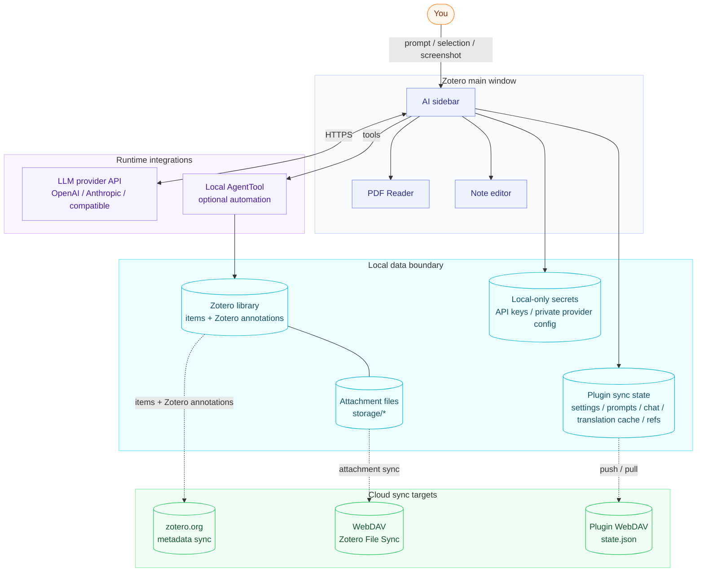
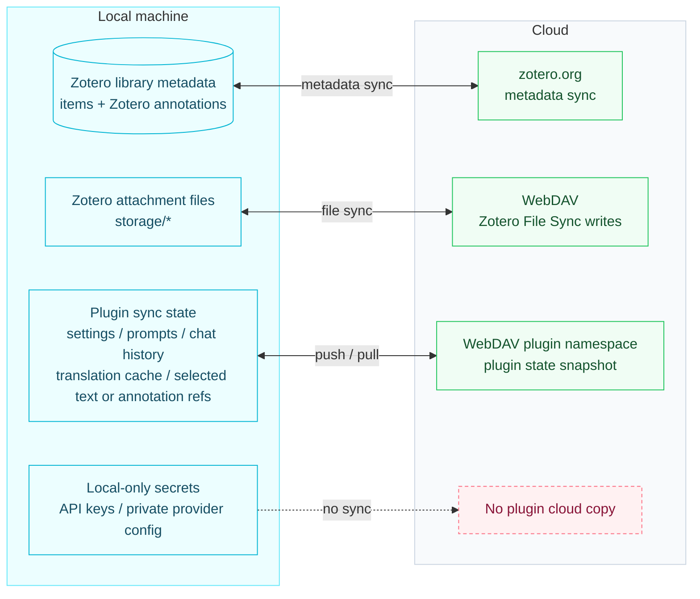

# Zotero AI Sidebar

[English](README.md) | [中文](README.zh-CN.md)

An AI research assistant that lives inside Zotero. Ask about the paper you're reading; the sidebar reads its PDF (or the arXiv LaTeX source when available), shows its work, and writes back to your notes.

> 👀 **[See it live — interactive 6-step walkthrough →](https://xuhan-rgb.github.io/zotero-ai-sidebar/quick-start.html)** (中/EN, product-faithful UI mockups)

📖 [Full usage guide](docs/USAGE.md) ([中文](docs/USAGE.zh-CN.md)) — quick start, workflows, reference, and troubleshooting.

## What you can do with it

- **Ask anything about the paper you're reading** — *"summarize this"*, *"what's the core contribution"*, *"compare with X"*. The model fetches the parts of the PDF it needs and shows its work in a tool trace.
- **arXiv papers come through clean** — equations and figures are pulled from the LaTeX source instead of broken PDF text. *"Explain Eq. (3)"* and *"walk me through Figure 2"* actually work.
- **Translate sentence by sentence in the PDF** — click a sentence, see the translation in place, walk through the paper with `Enter` / `Shift+Enter`.
- **Write back into Zotero** — append answers to the paper's note, or ask the model to add color-coded highlights to the PDF (gated by per-preset permission).
- **Bring your own model** — Anthropic, OpenAI, or any OpenAI-compatible endpoint; all configured locally in Zotero preferences.
- **Local-first with optional sync** — API keys stay on this machine; settings, chat history, and translation cache can sync through your own WebDAV `state.json`.

## Latest patch: v0.5.2

- **AI chat + translation cache WebDAV sync**: plugin sync now includes per-paper chat threads and the sentence-translation cache in the same remote `state.json`.
- **Non-destructive chat merge**: pulling from cloud appends missing remote messages without deleting local-only chat history.
- **Default-off auto sync**: when enabled, Zotero startup and every 10 minutes run pull-from-cloud first, then push the merged local state back to WebDAV.
- **Windows sync fix**: local chat/cache file paths now use Windows separators on Windows, avoiding mixed paths such as `C:\Users\admin\Zotero/...`.
- v0.5.1 fixed reading-route note saves for legacy note HTML; the v0.5.0 feature highlights remain below.

## What's New in v0.5.0

- **arXiv LaTeX source as analysis context**: for arXiv papers, the plugin downloads the e-print, cleans the TeX, and feeds the model the source instead of the PDF text layer. Equation (1) reaches the model as exact `\mathbb{E}_{\mathcal{D},\tau,\omega}[\ldots]` instead of garbled `f l θ`. The sidebar header shows a `LaTeX 源` badge when the current item is running on the arXiv source.
- **Section-on-demand context budget**: the pinned front block is only the section index; the model fetches bodies as needed via tools like `arxiv_get_section` and `arxiv_get_bibliography`. Non-arXiv items, and every failure path, fall back to the existing PDF full-text flow.
- **Numbered equation, figure & table lookup (arXiv)**: the model can call `arxiv_get_equation`, and `arxiv_get_figure` / `arxiv_get_table` accept numbered references — ask "explain Eq. (3)" or "what's in Table 2" and the model fetches the exact entry from the cached LaTeX source.
- **Figures rendered inline as multimodal context**: arXiv figures pulled by tool calls appear in the chat as images and are replayed as valid multimodal input on follow-up turns, so vision models actually see them.
- **Per-paper repaired markdown cache** (non-arXiv fallback): vertically fragmented math runs in the PDF text cache are detected, the formula is rendered and cropped from the PDF, and a vision model transcribes it back to LaTeX. The result is persisted per paper, so first-run pays the transcription cost and later turns reuse the cache.
- **Markdown pipe tables in chat**: assistant responses render `| col | col |` tables as real tables instead of leaving the raw pipes.
- **Composer history navigation**: press ↑ / ↓ in the empty composer to recall previous prompts, like a shell history.
- **Paper-source pinning on by default**: full-paper context is pinned by default with a warning before disabling it; whole-paper questions no longer get narrowed to a stale PDF selection.
- **Front-block debug file**: when the sidebar `调试` toggle is on, the exact `[Paper full text]` block sent that turn is also saved to a file under Zotero's data dir, and the Markdown export footer points at it for cross-checking what the model actually saw.

## Install

1. Download the latest `zotero-ai-sidebar.xpi` from [GitHub Releases](https://github.com/xuhan-rgb/zotero-ai-sidebar/releases/latest). Current release: [`v0.5.2`](https://github.com/xuhan-rgb/zotero-ai-sidebar/releases/tag/v0.5.2).
2. Open Zotero 7, 8, or 9.
3. Go to `Tools` -> `Plugins`.
4. Click the gear icon and choose `Install Plugin From File...`.
5. Select the downloaded `.xpi` file and restart Zotero if prompted.

This repository currently publishes only the `.xpi` file. Zotero automatic update manifests (`update.json` / `update-beta.json`) are intentionally not published in the simplified release flow.

## Configuration

Open the AI Sidebar settings in Zotero and configure at least one model preset:

- Provider: `anthropic` or `openai`
- API key: stored locally in Zotero preferences
- Base URL: official endpoint or an OpenAI-compatible endpoint
- Model: any model ID supported by that endpoint
- Max tokens / tool iterations: local safety and output controls

For PDF sentence translation, configure the translation section in plugin settings:

- Trigger mode: single-click or double-click
- Overlay: compact or adaptive size, placed above or below the sentence
- Context: translate the sentence alone, or include paragraph/page context
- Shortcuts: `Enter` for the next sentence, `Shift+Enter` for the previous (default)

Do not hardcode personal API keys, base URLs, or private model IDs in this repository.

## Features

### Chat & UI

- **AI chat inside Zotero**: open a dedicated sidebar and discuss the current paper without leaving Zotero.
- **Configurable providers**: supports Anthropic, OpenAI, and OpenAI-compatible endpoints through local Zotero preferences. Model presets include connectivity tests and a per-preset model list with a footer switcher.
- **Quick prompts & slash commands**: customizable prompt buttons next to the composer plus built-in slash commands (`/arxiv-search`, `/web-search`) that expand into explicit instructions for the model.
- **Markdown output**: renders headings, lists, code blocks, quotes, links, thinking/context blocks, and tool-call traces.
- **Selection context bar**: when PDF text is selected, the composer shows whether the next turn is `只看选区` or `选区 + 全文`, with a one-turn full-text override and selection preview.
- **Customizable chat UI**: nickname and avatar (emoji or image URL) for both user and AI, plus configurable position and layout for the per-message action buttons.
- **Clean / debug copy modes**: copy the conversation as Markdown with the paper introduction, dialogue, and selected PDF text; debug mode also includes tool context, PDF snippets, model-input layout, and thinking summaries.

### PDF & research tools

- **Model-driven Zotero tools**: follows a Codex-style tool loop; no local keyword/regex intent planner decides what PDF content to send.
- **PDF context tools**: current item metadata, annotations, PDF search, PDF range reading, full PDF reading, and selected-text context.
- **Selected-text source tracing**: selected passages are preserved in chat bubbles and Markdown exports, with a jump control back to the original PDF selection when Zotero provides location data.
- **Image context**: attach screenshots/images so the model can analyze figures, UI states, or PDF screenshots.
- **Customizable annotation color guide**: edit the natural-language rubric the model uses when picking PDF highlight colors, with a default that maps Zotero's six preset hexes to common review categories (background, problem, method, dataset, results, etc.).
- **arXiv paper tools**: `paper_search_arxiv` and `paper_fetch_arxiv_fulltext` let the model search arXiv and fetch full text on demand.

### Notes

- **In-pane note editor**: open a note column alongside the chat to edit Zotero's rich note in place, with an assistant-to-note write tool.
- **Model-driven note writes**: the model can also call `zotero_append_to_note` on its own to append assistant output to the current item's child note, auto-creating one when none exists.
- **Cursor-aware note imports**: select part of an assistant response, right-click `Import to note`, and the snippet is inserted at the current Zotero note cursor instead of always appending.
- **Stable note position**: after writing to a note, the note pane restores the previous scroll / mouse anchor / caret position instead of jumping to the top.
- **Back to original PDF selection**: exported note blocks and assistant context chips include a `View original selection` jump so you can return from notes or chat to the PDF passage that produced the answer.

### Translation

- **PDF sentence translation mode**: turn on `译` mode in the PDF Reader, click a sentence to translate it in-place, and move between sentences with `Enter` / `Shift+Enter`.

### Sync & config

- **Config backup & restore**: export/import account presets, UI settings, quick prompts, and tool/MCP settings as a single JSON file.
- **WebDAV cloud sync**: push and pull settings, quick prompts, translation settings, AI chat history, sentence-translation cache, and selected text / annotation references to a WebDAV endpoint (e.g. Nutstore) via a single `state.json` snapshot.
- **Auto sync**: disabled by default; when enabled, startup and every 10 minutes pull from cloud first, merge local chat/cache data, then push the merged state back to WebDAV.
- **Non-destructive chat sync**: cloud chat messages are appended when missing locally; existing local-only chat messages are preserved.
- **Local-first secrets**: API keys, base URLs, model names, and private provider settings stay in Zotero prefs, not in source code or plugin WebDAV sync.

## Architecture



### Three-layer cloud-sync split



## Development

Install dependencies:

```bash
npm install
```

Run tests:

```bash
npm test
```

Build a local XPI:

```bash
npm run build
```

The build output is written to `.scaffold/build/`. Local `.xpi` files are ignored by Git and should not be committed.

## Release

After `/auto-commit` updates the version, run `npm run release:xpi` — it tags, pushes, builds via GitHub Actions, and publishes the Release in one step. Flags (`--republish`, explicit tag) and verification details are in [`docs/RELEASE.md`](docs/RELEASE.md).

## Design notes

Project-specific modification guidance (Codex-style agent direction, Claudian-style chat UI, Better Notes-inspired note editing, non-negotiables) lives in [`CLAUDE.md`](CLAUDE.md). Tool / Web Search / MCP usage is in [`docs/TOOLS_AND_MCP.md`](docs/TOOLS_AND_MCP.md).

## License

AGPL-3.0-or-later.
