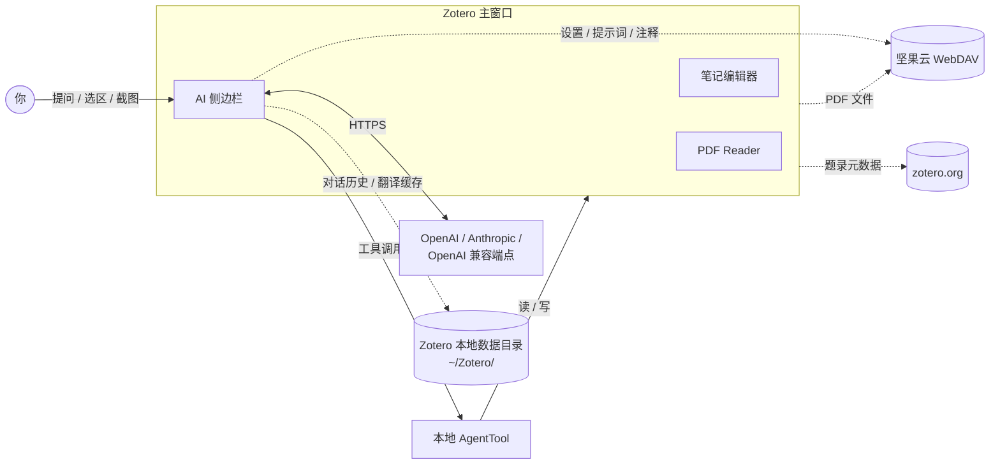
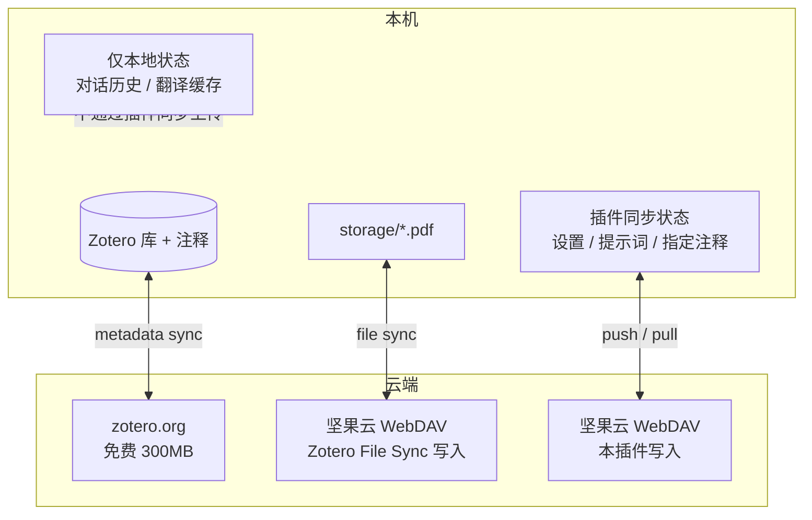

# Zotero AI Sidebar

[English](README.md) | [中文](README.zh-CN.md)

Zotero AI Sidebar 是一个适配 Zotero 7/8/9 的插件，会在条目面板 / PDF 阅读流程旁边加上一个 AI 对话面板。它被设计成一个轻量的论文研究 agent：由模型自己决定何时去查看当前 Zotero 条目、批注、PDF 片段、PDF 全文、截图，或通过插件暴露的 Zotero 工具写入批注。

📖 **[完整使用指南](docs/USAGE.zh-CN.md)** ([English](docs/USAGE.md)) —— 5 分钟上手、常见场景、功能手册、故障排查

🎨 **可视化操作走查**(GitHub Pages 已渲染,直接在浏览器看真实 sidebar 风格的 mockup):
- [5 分钟上手 · 中/EN 切换 · 6 步 × 12 张实景图(含 PDF 译模式)](https://xuhan-rgb.github.io/zotero-ai-sidebar/quick-start.html)
- [任务队列设计原型](https://xuhan-rgb.github.io/zotero-ai-sidebar/design_mockup.html)

## 亮点

- **Zotero 内置 AI 对话** —— 专属侧边栏始终知道你正在读哪一篇论文。
- **PDF 逐句翻译模式** —— 点击句子即可在原文旁显示译文，`Enter` / `Shift+Enter` 在句子间穿行。
- **PDF ↔ 笔记阅读闭环** —— 把回答写入 Zotero 笔记、从笔记跳回 PDF 原选区，并把选中的对话片段导入到当前笔记光标处。
- **自带模型自由切换** —— Anthropic、OpenAI 或任意 OpenAI 兼容端点，全部在 Zotero 偏好里本地配置。
- **读 PDF、写笔记和注释** —— 由模型驱动的工具覆盖全文、批注、截图，以及子笔记的写入。
- **本地历史 + WebDAV 配置同步** —— 对话历史 / 翻译缓存保存在本地，用一个 `state.json` 快照同步预设、提示词、设置和指定论文注释。

## v0.5.0-preview.1 更新

- **以 arXiv LaTeX 源码作为分析上下文**：对于 arXiv 论文，插件会下载源码包、清洗 TeX，把源码而不是 PDF 文本层喂给模型。Equation (1) 以原始 `\mathbb{E}_{\mathcal{D},\tau,\omega}[\ldots]` 抵达模型，不再是被压扁的 `f l θ`。侧边栏头部出现 `LaTeX 源` 徽章，标识当前条目在用 arXiv 源码分析。
- **按需读章节的上下文预算**：固定的前置块只放章节目录；模型用新增工具按需取正文 —— `arxiv_get_section`、`arxiv_get_figure`、`arxiv_get_bibliography`。非 arXiv 条目以及任何失败路径都自动回退到现有的 PDF 全文流程，不会回退失败。
- **逐论文公式修复 markdown 缓存（兜底）**：对于非 arXiv PDF，自动识别 PDF 文本缓存里被压扁的公式片段，从 PDF 里渲染裁切公式区域，由视觉模型转写回 LaTeX，整篇论文的修复结果持久化保存。首次问答付转写成本，后续轮复用缓存。
- **前置块调试文件**：侧边栏 `调试` 开启时，每轮发给模型的 `[Paper full text]` 原文块同时落到 Zotero 数据目录下的本地文件中，Markdown 导出末尾附上路径，方便核对模型实际看到了什么。

## 安装

1. 从 [GitHub Releases](https://github.com/xuhan-rgb/zotero-ai-sidebar/releases) 下载需要的 `zotero-ai-sidebar.xpi`。当前稳定版：[`v0.4.2`](https://github.com/xuhan-rgb/zotero-ai-sidebar/releases/tag/v0.4.2)；当前 preview（arXiv LaTeX 源 + PDF 公式修复）：[`v0.5.0-preview.1`](https://github.com/xuhan-rgb/zotero-ai-sidebar/releases/tag/v0.5.0-preview.1) —— `releases/latest` 仍然指向稳定版。
2. 打开 Zotero 7、8 或 9。
3. 进入 `工具` → `插件`。
4. 点击齿轮图标，选择 `从文件安装插件…`。
5. 选择刚下载的 `.xpi` 文件，按提示重启 Zotero。

当前仓库只发布 `.xpi` 文件。简化后的发布流程不再发布 Zotero 自动更新清单（`update.json` / `update-beta.json`）。

## 配置

在 Zotero 中打开 AI Sidebar 设置，至少配置一个模型预设：

- 提供商：`anthropic` 或 `openai`
- API Key：保存在本地 Zotero 偏好中
- Base URL：官方端点或任何 OpenAI 兼容端点
- 模型：该端点支持的任意模型 ID
- Max tokens / 工具循环上限：本地的安全与输出长度控制

PDF 逐句翻译可在插件设置的“翻译”区域调整：

- 触发方式：单击或双击句子触发
- 浮层显示：紧凑 / 自适应尺寸，可显示在句子上方或下方
- 上下文范围：仅翻译当前句，或附带本段 / 本页上下文
- 句子导航：默认 `Enter` 跳到下一句，`Shift+Enter` 返回上一句

请勿在本仓库中硬编码个人 API Key、Base URL 或私有模型 ID。

## 功能特性

### 对话与界面

- **Zotero 内置 AI 对话**：直接在专属侧边栏与当前论文对话，无需离开 Zotero。
- **多提供商可配置**：通过 Zotero 本地偏好支持 Anthropic、OpenAI 以及任何 OpenAI 兼容端点。账号预设支持连通性测试，可为每个预设配置独立的模型列表并通过底部切换器快速切换。
- **快捷提示词与 Slash 命令**：在输入框旁边可自定义提示词按钮，并内置 `/arxiv-search`、`/web-search` 等 slash 命令，这些命令会被展开成给模型的明确指令。
- **Markdown 输出**：渲染标题、列表、代码块、引用、链接、思考/上下文块，以及工具调用轨迹。
- **选区上下文条**：PDF 有选中文本时，输入框上方会显示下一轮是 `只看选区` 还是 `选区 + 全文`，并提供本轮全文覆盖和选区预览。
- **可定制聊天界面**：用户和 AI 的昵称、头像（emoji 或图片 URL）均可自定义，每条消息的操作按钮位置和布局也可配置。
- **干净 / 调试两种复制模式**：将对话以 Markdown 复制时，普通导出包含论文介绍、对话和当轮 PDF 选区；调试模式额外附带工具上下文、PDF 片段、模型输入顺序和思考过程。

### PDF 与论文研究工具

- **由模型驱动的 Zotero 工具**：使用 Codex 风格的工具循环；不靠本地关键词/正则的意图判定来决定该把哪些 PDF 内容塞给模型。
- **PDF 上下文工具**：当前条目元信息、批注、PDF 全文检索、PDF 区间阅读、PDF 全文阅读，以及划选文本作为上下文。
- **选区原文溯源**：选中的 PDF 原文会保留在对话气泡和 Markdown 导出中；当 Zotero 提供定位信息时，可一键跳回 PDF 原选区。
- **图像上下文**：可以附带截图或图片，让模型分析图表、界面状态或 PDF 截图。
- **可自定义注释颜色规则**：可编辑模型写入 PDF 注释时使用的自然语言色彩规则，默认把 Zotero 的六种预设 hex 颜色映射到论文阅读常用类别（背景、问题、方法、数据集、结果等）。
- **arXiv 论文工具**：内置 `paper_search_arxiv` 和 `paper_fetch_arxiv_fulltext`，模型可按需检索 arXiv 并抓取全文。

### 笔记

- **面板内笔记编辑器**：在对话旁打开笔记列，直接就地编辑 Zotero 的富文本笔记，并提供 assistant 写入笔记的工具。
- **模型主动写入笔记**：模型也可以自行调用 `zotero_append_to_note`，把助手输出追加到当前条目的子笔记中，没有子笔记时会自动创建。
- **按当前光标导入片段**：选中一段助手回答后右键 `导入笔记`，会优先插入到当前 Zotero 笔记光标处，而不是固定追加到末尾。
- **稳定恢复笔记位置**：写入笔记后会恢复原来的滚动位置 / 鼠标锚点 / 光标位置，避免跳回笔记最开头。
- **返回 PDF 原选区**：写入笔记的块和助手上下文标签会带 `查看原选区` 跳转，方便从笔记或对话回到触发回答的 PDF 原文。

### 翻译

- **PDF 逐句翻译模式**：在 PDF Reader 中打开 `译` 模式，点击句子即可在原文旁显示译文，并可用 `Enter` / `Shift+Enter` 切换下一句 / 上一句。

### 同步与配置

- **配置备份与恢复**：把账号预设、显示设置、快捷提示词、联网/MCP 设置打包为一个 JSON 文件，可导出 / 导入。
- **WebDAV 云同步**：将设置、快捷提示词、翻译设置以及指定论文注释，通过单个 `state.json` 快照推送到 / 拉取自任意 WebDAV 端点（如坚果云）。
- **对话和翻译缓存本地保存**：对话历史和逐句翻译缓存保存在 Zotero 本地数据目录（通常是 `~/Zotero/`）下，不会被插件的 WebDAV 同步上传。
- **本地优先**：API Key、Base URL、模型名以及私有提供商配置都保存在 Zotero 偏好里，不写进源代码。

## 总体架构



### 三层云同步分工



## 开发

安装依赖：

```bash
npm install
```

运行测试：

```bash
npm test
```

本地构建 XPI：

```bash
npm run build
```

构建产物在 `.scaffold/build/`。本地 `.xpi` 文件已被 `.gitignore` 忽略，不要提交。

## 发布

`/auto-commit` 完成版本号更新后，运行 `npm run release:xpi` 即可一步完成打 tag、推送、GitHub Actions 构建并发布 Release。`--republish`、显式 tag 等参数及校验细节见 [`docs/RELEASE.md`](docs/RELEASE.md)。

## 设计原则

项目特定的修改指引（Codex 风格 agent、Claudian 风格对话 UI、Better Notes 风格笔记编辑、不可触碰的红线）都在 [`CLAUDE.md`](CLAUDE.md)。本地工具 / Web Search / MCP 的使用边界见 [`docs/TOOLS_AND_MCP.md`](docs/TOOLS_AND_MCP.md)。

## 许可证

AGPL-3.0-or-later。
